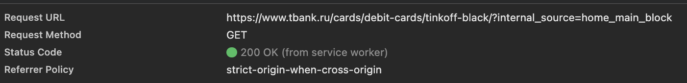
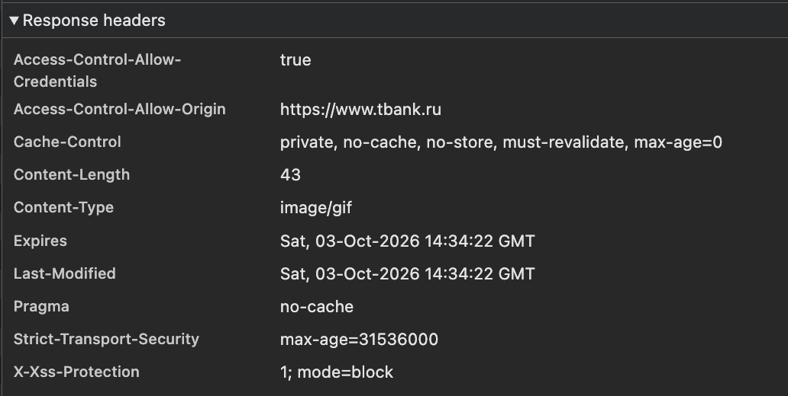
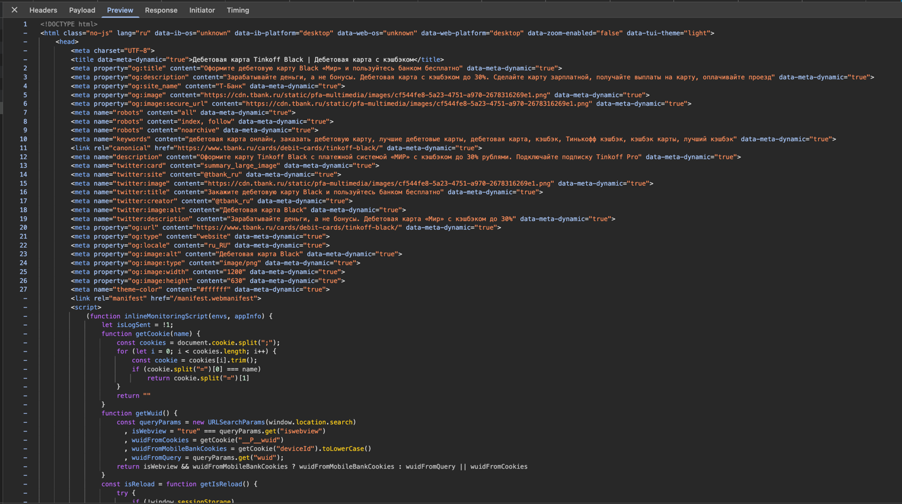
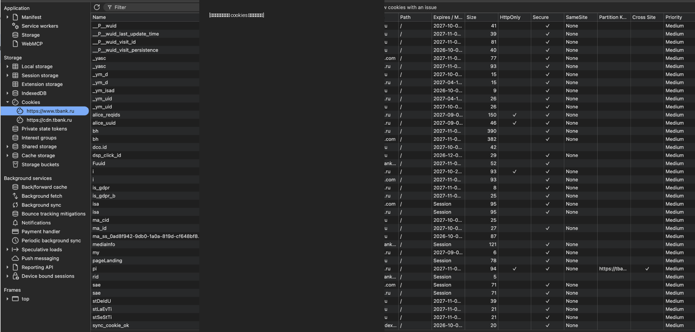
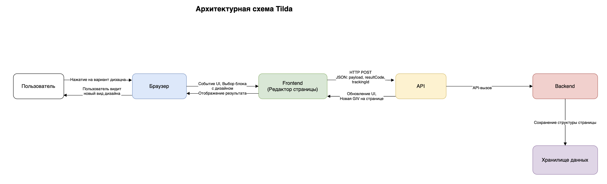

[lab2.md](https://github.com/user-attachments/files/33124318/lab2.md)
# Лабораторная работа №2

## Анализ веб-приложения и клиент-серверного взаимодействия

**Вариант:** 9  
**Исследуемый сервис:** Т-Банк  
**Сайт:** https://www.tbank.ru/  
**Пользовательский сценарий:** изучение публичных продуктов и формы заявки на дебетовую карту.

## 1. Исследуемая информационная система

В продолжение лабораторной работы №1 исследовалась публичная часть веб-сервиса Т-Банка, в частности страница дебетовой карты Black.

В ходе исследования использовался браузер с инструментами разработчика DevTools, вкладка Network. Анализ проводился без выполнения реальных банковских операций и без отправки настоящей заявки.

В исследовании наблюдались следующие компоненты:

- пользователь;
- браузер;
- клиентская часть веб-приложения;
- HTTP/API-запросы;
- серверная часть;
- внешние сервисы аналитики;
- cookies и локальное состояние браузера.

## 2. Анализ HTTP-запросов

В DevTools Network были обнаружены запросы разных типов. В частности, наблюдались методы **GET**, **POST** и **OPTIONS**.

| Метод | Пример | Назначение / наблюдение |
|---|---|---|
| GET | `https://www.tbank.ru/cards/debit-cards/tinkoff-black/?internal_source=home_main_block` | Получение страницы продукта |
| POST | `https://www.tbank.ru/api/front/eventea-beer/event` | Отправка события на серверный API-эндпоинт |
| OPTIONS | запросы к внешним ресурсам | Проверка возможностей ресурса перед обращением |

### GET-запрос страницы продукта

Для страницы дебетовой карты был зафиксирован запрос:

- **Request URL:** `https://www.tbank.ru/cards/debit-cards/tinkoff-black/?internal_source=home_main_block`
- **Request Method:** `GET`
- **Status Code:** `200 OK`
- **Referrer Policy:** `strict-origin-when-cross-origin`

GET-запрос используется браузером для получения представления ресурса. В данном случае браузер получает страницу продукта.

### POST-запрос API

В ходе отдельного наблюдения в Network был обнаружен запрос:

- **Request URL:** `https://www.tbank.ru/api/front/eventea-beer/event`
- **Request Method:** `POST`
- **Status Code:** `200 OK`
- **Type:** `fetch`
- **Content-Type ответа:** `application/json; charset=utf-8`

По структуре URL данный запрос относится к API-части веб-приложения. По названию `event` его назначение можно интерпретировать как передачу события, однако точное бизнес-назначение по одному URL однозначно установить нельзя.

## 3. Анализ HTTP-ответов

HTTP-ответ содержит статус-код, заголовки и тело ответа.

Для GET-запроса страницы продукта был получен статус **200 OK**. Это означает, что запрос был успешно обработан.

Для POST-запроса к `/api/front/eventea-beer/event` также был получен статус **200 OK**.

В исследовании также наблюдались ответы с типом содержимого `text/html` для HTML-ресурсов и `application/json` для API-запроса.

### Заголовки ответа

В DevTools были обнаружены различные HTTP-заголовки, среди которых:

- `Content-Type`;
- `Content-Length`;
- `Cache-Control`;
- `Content-Encoding`;
- `Content-Security-Policy`;
- `Server`;
- `Date`;
- `X-Request-Id`;
- другие служебные заголовки.

В некоторых ответах был виден серверный компонент `MSX Turbo R (R900) Web Server 1.13`. Наличие такого заголовка является наблюдаемым фактом, однако по нему нельзя делать вывод о всей внутренней архитектуре серверной части.

## 4. Анализ параметров и передаваемых данных

При исследовании запросов были обнаружены различные параметры URL и параметры запросов.

Для GET-запроса страницы присутствует параметр:

`internal_source=home_main_block`

Он передаётся в URL и связан с источником перехода на страницу продукта.

Также в DevTools наблюдались запросы к внешним сервисам, содержащие параметры страницы, браузера и события. Один из исследованных запросов был связан с сервисом `mc.yandex.com` и содержал параметры, описывающие URL страницы и событие взаимодействия.

В одном из запросов DevTools отображал параметры авторизационного контекста (`state`, `client_id`, `code_challenge`, `code_challenge_method`, `response_type`, `redirect_uri`). Значения таких параметров в отчёт не переносятся, поскольку они могут иметь чувствительный характер.

Отдельно исследовался HTML-ответ страницы продукта. В Preview были видны HTML-разметка, метаданные страницы, ссылки на ресурсы и клиентский JavaScript.

## 5. Анализ cookies

В DevTools → Application → Cookies были обнаружены cookies для домена `.tbank.ru`, а также cookies внешних сервисов.

В отчёт намеренно не переносятся значения cookies.

| Cookie | Домен | Назначение | Флаги |
|---|---|---|---|
| `dsp_click_id` | `.tbank.ru` | Предположительно отслеживание рекламного перехода | Secure |
| `__P__wuid_visit_id` | `.tbank.ru` | Предположительно идентификация/отслеживание визита | Secure |
| `_P__wuid` | `.tbank.ru` | Идентификатор, используемый клиентской аналитикой | Secure |
| `pageLanding` | `.tbank.ru` | Сохранение информации о странице/источнике перехода | Secure |

Назначение части cookies определено предположительно по имени и контексту их использования. Точное назначение без документации сервиса установить нельзя.

На скриншоте ниже значения cookies скрыты.

## 6. Взаимодействие Frontend, API и Backend

Исследование показывает следующую последовательность взаимодействия:

1. Пользователь открывает страницу дебетовой карты.
2. Браузер отправляет HTTP GET-запрос.
3. Сервер возвращает HTML-страницу и связанные ресурсы.
4. JavaScript клиентской части выполняется в браузере.
5. При действиях пользователя браузер может выполнять дополнительные HTTP-запросы.
6. Часть запросов обращается к API Т-Банка.
7. Часть запросов выполняется к внешним сервисам аналитики.
8. Полученные ответы обрабатываются клиентской частью.
9. Результат отображается в интерфейсе.

В материалах исследования отдельно зафиксирован сценарий выбора дизайна карты. После действия пользователя выполняется GET-запрос к внешнему сервису аналитики `mc.yandex.com`. Передаваемые данные имеют тип `image/gif`, а результат взаимодействия связан с фиксацией пользовательского события.

Таким образом, этот запрос демонстрирует прежде всего связь клиентской части с внешним сервисом аналитики, а не бизнес-операцию оформления банковской карты.

## 7. Сопоставление с архитектурой из лабораторной работы №1

В лабораторной работе №1 была предложена архитектура:

**Пользователь → Браузер → Пользовательский интерфейс → Клиентская часть → API → Серверная часть → Хранилище данных / Внешние сервисы.**

Результаты второй лабораторной позволяют подтвердить следующие элементы:

- **Браузер** — непосредственно наблюдается через DevTools.
- **Пользовательский интерфейс** — наблюдается на странице продукта.
- **Клиентская часть** — подтверждается HTML, JavaScript и сетевыми запросами.
- **API** — подтверждается наличием запросов к URL вида `/api/...`.
- **Серверная часть** — подтверждается HTTP-ответами и серверными заголовками.
- **Внешние сервисы** — непосредственно наблюдаются по запросам к внешним доменам, в частности `mc.yandex.com`.

При этом конкретная внутренняя реализация backend, структура баз данных и конкретные технологии хранения данных непосредственно из DevTools не установлены. Поэтому они остаются архитектурными предположениями.

В ходе второй лабораторной была более подробно подтверждена связь клиентской части с API и внешними сервисами аналитики.

## 8. Схема взаимодействия компонентов

Отдельная схема взаимодействия показывает прохождение пользовательского действия через браузер и клиентскую часть к HTTP-запросу, API/серверу и внешним сервисам.

Для сценария выбора дизайна карты схема отражает:

- действие пользователя;
- работу интерфейса;
- обработку действия клиентской частью;
- HTTP GET;
- передачу данных;
- получение HTTP-ответа;
- обновление интерфейса;
- взаимодействие с внешним сервисом аналитики.

Исходный файл схемы находится в каталоге `diagrams`.

## 9. Вывод

В ходе лабораторной работы было исследовано HTTP-взаимодействие веб-приложения Т-Банка.

С помощью DevTools были изучены HTTP-методы GET, POST и OPTIONS, URL запросов, статус-коды, заголовки и типы возвращаемых данных. Был отдельно рассмотрен API-запрос `POST /api/front/eventea-beer/event` со статусом `200 OK`.

Также были исследованы параметры запросов и cookies. Значения cookies и другие потенциально чувствительные значения в отчёт не переносились.

На основе наблюдений было рассмотрено взаимодействие пользователя, браузера, клиентской части, API, серверной части и внешних сервисов. Результаты сопоставлены с архитектурой из лабораторной работы №1.

Важно отметить, что непосредственно через DevTools можно наблюдать сетевое взаимодействие, но нельзя достоверно определить всю внутреннюю реализацию backend и хранилищ. Поэтому такие компоненты, как конкретная СУБД или внутренняя серверная логика, остаются предположениями.
